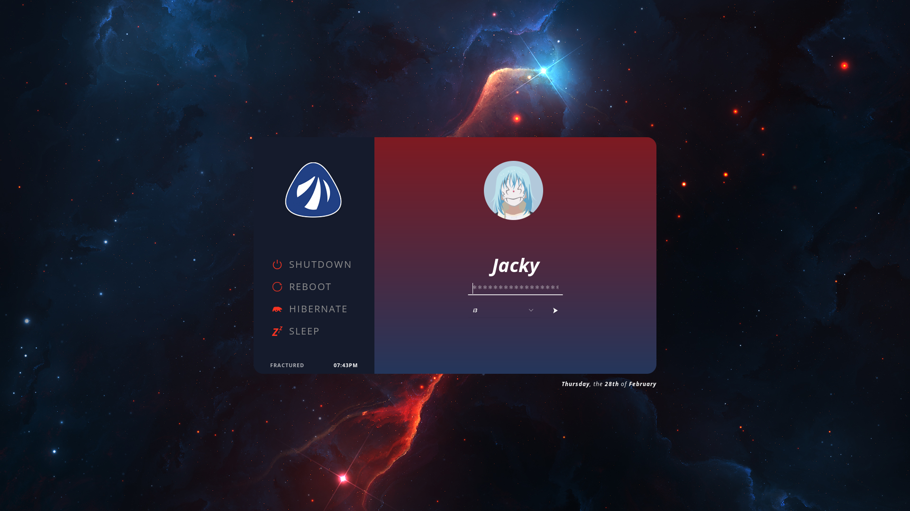
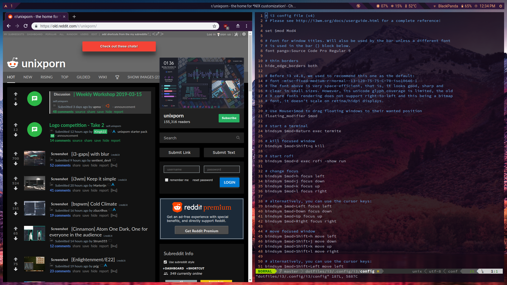

# .FILES
dotfiles for personal use. dotfiles are custom user configuration files.
They usually start with a period, hence the name. I've included some notes for what I use.

I use i3 on Antergos with Xfce4 services installed prior. System is not bug free.
Running on a ThinkPad X1 Carbon (gen. 5).

Todo: Upload new screenshots. Add Antergos memorial.

# Previews
<p align="center">
    
</p>

### Display Manager - `lightdm` with [`aether`](https://github.com/NoiSek/Aether) theme
<p align="center">
    
</p>

### [Lock screen](https://github.com/JackyFWong/dotfiles#betterlockscreen) - betterlockscreen
<p align="center">
    
</p>

### [neofetch](https://github.com/JackyFWong/dotfiles#neofetch)
<p align="center">
    
</p>

### [rofi](https://github.com/JackyFWong/dotfiles#rofi)
<p align="center">
    
</p>

### r/unixporn and [i3](https://github.com/JackyFWong/dotfiles#i3gaps) config
<p align="center">
    
</p>

### YouTube, gotop, and cmatrix
<p align="center">
    
</p>

### Coding example
<p align="center">
    
</p>

### [wpgtk](https://github.com/JackyFWong/dotfiles#wpgtk) (colors submenu)
<p align="center">
    
</p>

### Spotify and cava
<p align="center">
    
</p>

<!-- EXPLANATIONS START -->

<!-- for those in the repo -->
# Current dots
## [i3(gaps)](https://github.com/Airblader/i3)
### Notes
i3 was introduced to me by my friend who recommended it because of the large user base, 
ease of customization, and productivity. It's the first one I tried and I haven't had a 
reason to switch.

I use the branch i3gaps because of aesthetics.

I rebound the movement keys to vim's `hjkl` instead of the default `jkl;`.

I used [Alex's guide](http://flux242.blogspot.com/2015/10/using-i3-tiling-window-manager-with.html)
to ensure that I could use i3 and Xfce services together somewhat smoothly. 

There was a bug with the xfce4-panel and using the Windows button as `$mod`. I figured it out
[here](https://forum.antergos.com/topic/10809/no-running-instance-of-xfce4-panel-was-found/3).

#### Keyboard rebindings
- PrtSc -> `xfce4-settings-manager` > Keyboard > Application Shortcuts > add 
`xfce4-screenshooter` as a command
- Microphone toggle -> 'xfce4-settings-manager' > Keyboard > Application Shortcuts > add 
`amixer set Capture toggle` as a command

### Installation
```
pacman -S i3-gaps
```

## [neofetch](https://github.com/dylanaraps/neofetch)
### Notes
neofetch displays system information in a nice manner and is relatively configurable.
### Installation
```
pacman -S neofetch
```

## [polybar](https://github.com/jaagr/polybar)
### Notes
I saw on r/unixporn that a lot of people used polybar, so I decided to try it out.
polybar is a fast and easy to use status bar, as well as very customizable.
### Installation
```
yay -S polybar
```

## [termite](https://github.com/thestinger/termite)
### Notes
Again, I saw some pretty screenshots on r/unixporn. termite aims to be used within a WM
with tiling support and has similar keybindings to Vim, so that fits me perfectly.

I still don't understand most of termite, so there is a lot for me to learn.
### Installation
```
pacman -S termite
```

## vim
### Notes
It's Vim. Which is not on a default Arch/Antergos installation.
### Installation
```
pacman -S vim
```

## zsh
### Notes
Much like termite, I haven't learned most of zsh. 
For now, it is bash with tab completion and pretty default prompts.
### Installation
```
pacman -S zsh
```
Use `zsh` to run `zsh-newuser-install`.
#### Replace bash with zsh
Move the code you want to save (e.g. aliases and prompt) to ~/.zshrc.

Assuming zsh is installed correctly,
```
chsh -s /bin/zsh
```

## [powerline](https://github.com/powerline/powerline)
### Notes
I use powerline for the shell prompt and to make vim look better.
### Installation
```
pacman -S powerline
pacman -S powerline-fonts
```
Currently mostly default settings. Check the Arch Wiki.

## [rofi](https://github.com/DaveDavenport/rofi)
### Notes
rofi is a good alternative to the i3's default dmenu. Provides more customization options.
### Installation
```
pacman -S rofi
```

## [wpgtk](https://github.com/deviantfero/wpgtk)
### Notes
Changed from `pywal` because pywal no longer supports oomox.

I change my background image a lot and I don't have good color sense, 
so I use `wpgtk` to solve this.
wpgtk can change the color scheme of your entire system with one terminal line based on a
specified background. It's really great. Seriously, it's good. Templates too.
### Installation
```
yay -S wpgtk-git
```
To create new default templates
```
wpg-install.sh
```
Use option `-h` for help.

Also, select FlatColor under xfce4-appearance-settings > style.
### Configuration
Use the GUI, it's really nice and easy.
```
wpg
```

Reload in i3 in its config
```
exec --no-startup-id $HOME/.config/wpg/wp_init.sh
```
Use xfce4-appearance-settings to reload the GTK+ theme for existing applications.
Click off of FlatColor and reselect FlatColor.

The wallpapers are symlinked to images in my `~/Pictures/Wallpapers/` directory.

## [compton (tryone144 fork)](https://github.com/tryone144/compton)
### Notes
A compositor for X. This fork adds the useful kawase blur method. I use it for transparency, 
screen transitions, window shadows, and now blur.

### Installation
```
yay -S compton-tryone-git
```
Activate with i3 in its config
```
exec_always --no-startup-id compton
```
You can restart compton via 
```
pkill compton
compton
```

## [spicetify-cli](https://github.com/khanhas/spicetify-cli/)
### Notes
This is a theming tool for Spotify. It works well with `wpgtk`.

### Installation
```
yay -S spicetify-cli
```
To complete the setup, grant write permissions to Spotify's executable
```
sudo chmod 777 /opt/spotify -R
```
and then you have to generate the config file
```
spicetify
```
then change the `config.ini` file's `spotify_path` variable to `/opt/spotify`. Then run
```
spicetify backup apply enable-devtool
```
### Configuratoin
Each theme must have a `color.ini` and `user.css` file in the theme's own named folder.

Edit the `config.ini` file to the appropriate theme (folder) name then
```
spicetify update
```
You can use `Ctrl` `Shift` `R` inside Spotify to restart the theme.

<!-- not in repo -->
# Other Programs
## [betterlockscreen](https://github.com/pavanjadhaw/betterlockscreen)
### Notes
I found this in r/unixporn's top of all time list 
[here](https://old.reddit.com/r/unixporn/comments/7iddwn/i3lock_faster_and_better_lockscreen/).
In my opinion, it looks much better than i3lock's default settings and I don't really care to 
customize the lock screen that much so I took somebody else's.
### Installation
```
yay -S betterlockscreen
```
### Configuration
Set an image as the lock screen
```
betterlockscreen -u "/path/to/image.jpg"
```
Set to lock screen with i3 keyboard shortcut in its config
```
bindsym $mod+Shift+x exec betterlockscreen -l dimblur
```
The optional `dimblur` argument asks betterlockscreen to dim and blur the lock screen image.

## Firefox
### Notes
I switched to Firefox after being fed up with Google and how they are removing the effectiveness 
of ad blockers in Chrome/Chromium.

There's a lot of customization you have to do in order to somewhat mirror Chromium's behavior. 
Mess around in Preferences and `about:config` until the desired results. Kinetic scrolling does 
not work.
### Installation
```
pacman -S firefox
```
In order to keep a dark `wpgtk` theme and have readable text input boxes, 
1. Open `about:config`
2. Create new String value `widget.content.gtk-theme-override`
3. Set the value to a light GTK theme, I used `Adwaita`
4. Restart Firefox to apply

<!-- OTHER STUFF -->

# Fonts used
I have noto-fonts, ttf-dejavu, adobe-source-code-pro-fonts, ttf-ms-fonts, ttf-font-awesome, 
and [Nerd Fonts](https://github.com/ryanoasis/nerd-fonts) installed.
Roboto is my main system font, Source Code Pro is my main monospace font.

# Managing dotfiles
I used [Brandon Invergo's guide](http://brandon.invergo.net/news/2012-05-26-using-gnu-stow-to-manage-your-dotfiles.html)
and GNU Stow to manage my dotfiles.

Do this after installing the packages you use.
### Installation
```
pacman -S stow
```
Follow Invergo's guide for more detail. Note that the files should be moved from `.config/` to 
`dotfiles/`, not copied.
### Configuration
Go to your main dotfiles directory. Execute `stow` followed by the folder name that contains
an application's configuration files. For example, `stow i3`.

# Wallpapers
I use [Wallhaven](https://wallhaven.cc/) for my non-anime wallpapers. Otherwise, they're from 
DeviantArt, Pixiv, or Reddit. I have modified some of the wallpapers. All original works belong to their 
respective owners, so please don't go sharing my modified versions. When choosing wallpapers, 
choose those that have good contrast for coding visibility.

# Other
Currently on the second iteration of ricing. My first used KDE Plasma and i3 as the WM.

Don't forget to `pacman -Syu` and `yay`!
